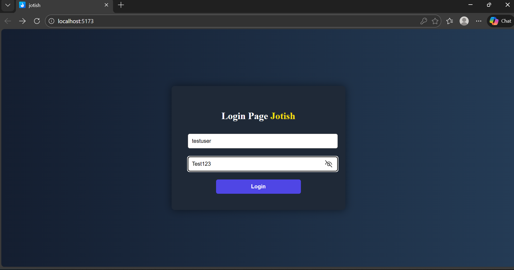
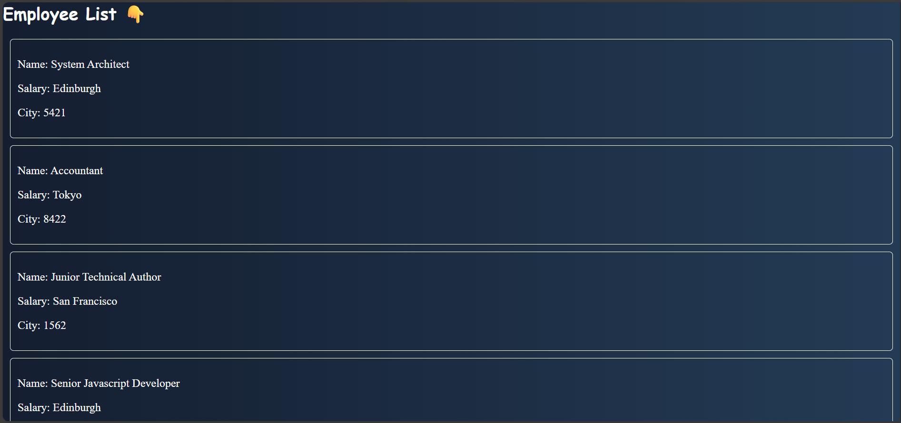
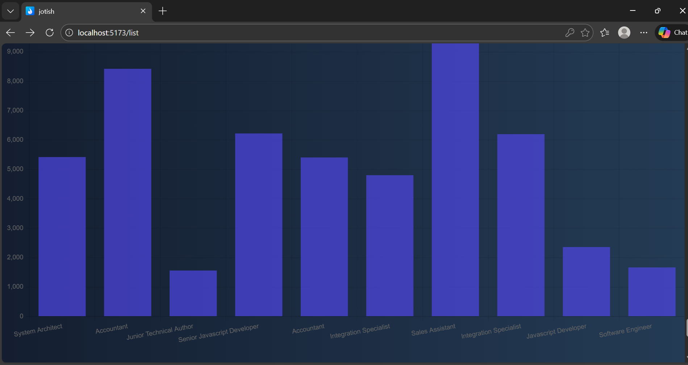
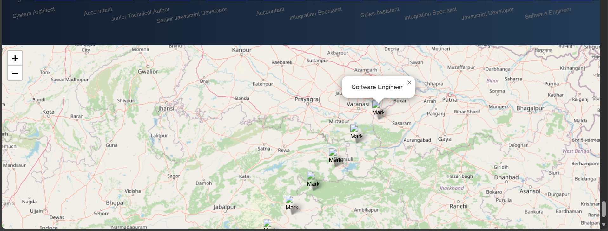
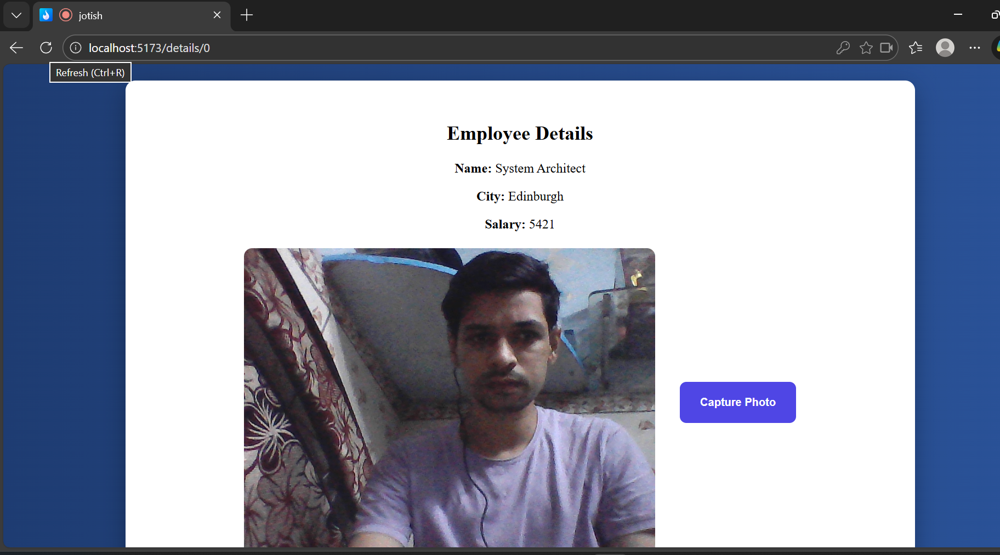
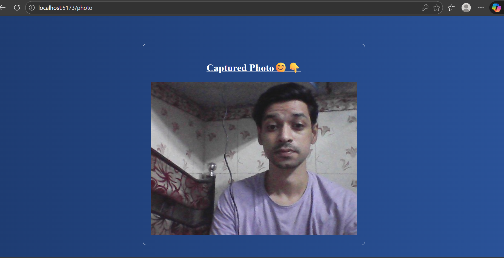

# 🚀 Jotish React Assignment

A complete React.js application built as part of the Jotish technical assignment.

---

## 📌 Project Overview

This application includes:

- 🔐 Login Authentication
- 📡 API Data Fetch (POST Request using Axios)
- 📋 Employee List Page
- 👤 Employee Details Page
- 📸 Webcam Photo Capture
- 📊 Salary Bar Chart (Chart.js)
- 🗺 Employee Location Map (React Leaflet)
- 🖼 Photo Result Page

---

## 🛠 Tech Stack

- React.js
- React Router DOM
- Axios
- Chart.js
- React ChartJS 2
- React Leaflet
- Leaflet
- Vite

---

## 📷 Screenshots

### 🔐 Login Page


---

### 📋 Employee List


---

### 📊 Salary Chart


---

### 🗺 Map View


---

### 👤 Employee Details + Webcam


---

### 📸 Captured Photo Page


---

## ⚙️ Installation & Setup

Clone the repository:

```bash
git clone https://github.com/yourusername/jotish-react-assignment.git

⭐ API Used 
##POST method
https://backend.jotish.in/backend_dev/gettabledata.php

⭐ Deployed Link
https://jotishreactassignment.netlify.app/

